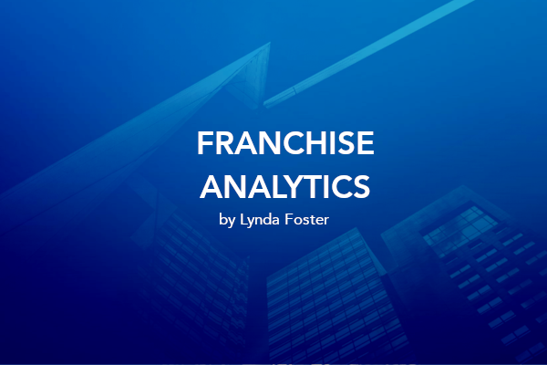

# Franchise Calculator

App that calculates which two locations (within a provided csv file) that are furthest apart. An exercise in geolocation, csv parsing, and logging. 

Application: Analysis tool for franchise owners determine which areas are in need of expansion or more coverage.

https://lfost42-franchisecalculator.herokuapp.com 

## WALKTHROUGH

Minimal Viable Product:

A console application that parses through the provided csv file, calculates the locations that are furthest apart, and writes the result to the console. 

OTHER FEATURES:

Completed: 

1. Build a Class Library and move methods into classes.
2. Implement DAO (Data Access Object) to decouple the data access layer from the user interface.
3. Swap the UI and develop an ASP.NET Core MVC web application. 

Future Updates:

4. Consume an API for mapping purposes. 
5. Display locations on a map. 
6. Display algorithm results on a map. 
7. Add an option to exclude stores from the list of locations. 
8. Improve time complexity. 
9. Add a dashboard
10. Option to dashboard results. 

## OPEN REQUIREMENTS
MVP
	- landing page will load CSV file and return the two locations that are furthest apart

Other features:

- Consume a mapping API to display locations on a map
- Display algorithm results on a map
- List each location prior to running algorithm. User may de-select location from list.
	-- Algorithm runs on new list and full list

DASHBOARD

- Number locations in file.
- Average distance between each location.
- Mean distance between each location.
- Top 5 pairs of locations that are furthest apart from each other. 
- Option to export dashboard results. 

## USER INTERFACE
- Landing page
- Options to run algorithm or filter list
- Options to run algorithm on full or filtered list (or both, different color indicators for map)
- Dashboard updates after csv file is uploaded, refreshes when algorithm is run

## LOGIC DESIGN
- csv parsing
- mapping API

## DATA DESIGN
- location (object with latitude, longitude, name)
- locations --> list of locations
- distances - caching/csv output?

- data access - locates CSV
- parsing - parses through CSV list (or filtered list)

### Origins

The project's minimal viable product culminated the C# segment of the Software Engineering course at True Coders (https://truecoders.io). The coding challenge was to parse a csv file of approximately 300 Taco Bell locations and determine which two are furthest apart from one another with logging and unit tests. 